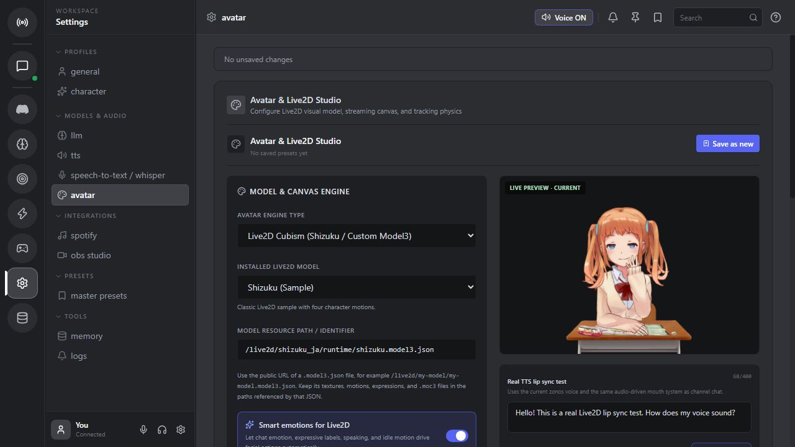
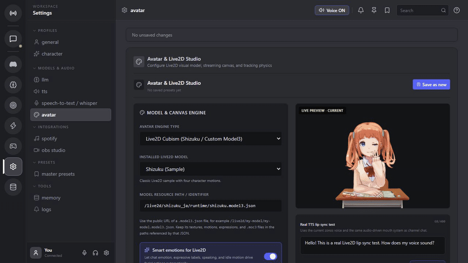

# Vtubecord desktop app

The desktop target wraps the existing React/Vite interface in a native
Tauri/WebView2 window. It does not open Chrome or Edge as the application UI,
and the bundled Rust launcher starts the FastAPI server without a console
window.

## Visual preview





[Download the MP4 walkthrough](../docs/media/live2d-ui.mp4)

## Development

From this directory:

```powershell
npm install
npm run dev
```

`npm run dev` expects the normal backend to already be running on
`http://127.0.0.1:8000` (for example through `START.bat`).

## Windows release installer

`npm run build:release` builds the frontend, packages the backend into
`VtubecordServer.exe` when it is not already present, and produces:

```text
src-tauri/target/release/bundle/nsis/Vtubecord_0.1.0_x64-setup.exe
src-tauri/target/release/bundle/msi/Vtubecord_0.1.0_x64_en-US.msi
```

The same release build packages `VtubecordUpdater.exe` in
`updater/dist/` and embeds it in the installer resources. The updater checks
the latest GitHub release, downloads the matching Windows installer, verifies
its checksum when GitHub provides one, and starts the installer without a
terminal window. Set `VTUBECORD_GITHUB_REPOSITORY=owner/repository` when
building (the GitHub Actions workflow does this automatically), or put the
repository in `src-tauri/resources/update-config.json` for a local build.
When a checkout has an `origin` GitHub remote, the release script derives the
repository automatically.

For a manual check from a packaged build:

```powershell
.\updater\dist\VtubecordUpdater.exe --check-only
```

See [`updater/README.md`](updater/README.md) for configuration and command
line options.

The release build also creates
`src-tauri/target/release/bundle/Vtubecord_0.1.0_portable.zip`. This archive
contains the native app, bundled server, updater, and resource files. It can
be extracted anywhere and launched with `Vtubecord.exe`; writable data stays
under `%LOCALAPPDATA%\\Vtubecord`.

The first build downloads the Rust crates, Tauri bundler tools, and the
WebView2 bootstrapper. The generated installer is x64 and keeps model weights
out of the application package; users download those through Vtubecord.

## Runtime data

The installed app stores writable data in `%LOCALAPPDATA%\\Vtubecord` and
passes that location to the backend. Source assets are read from the packaged
resources, so the app does not need a checkout, Python, or Node.js to run.
